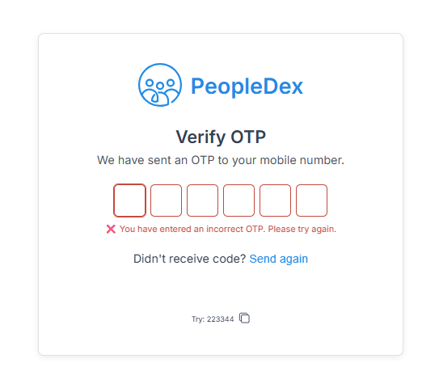

## 📸 Screenshots

### Desktop and Mobile view


### Error State


### Success State


<!-- ### Demo
 -->

## 🔧 Key Features Explained

### Auto-focus Management

- Automatically moves focus to the next field when a digit is entered
- Moves to previous field on backspace
- Supports arrow key navigation

### Paste Support

- Detects when OTP is pasted from clipboard
- Automatically fills all fields with pasted digits
- Validates and submits if complete OTP is pasted

### Keyboard Navigation

- **Arrow Keys**: Navigate between fields
- **Backspace**: Clear current field and move to previous
- **Delete**: Clear current field
- **Numbers**: Enter digits (0-9)

### Error Handling

- Visual error state with red styling
- Clear error messages
- Auto-clear errors on new input

### Success States

- Green success indication
- Auto-disable inputs after successful verification
- Success message display

## �� Testing

```bash
# Run tests
npm test

# Run tests in watch mode
npm run test:watch
```

## 📱 Mobile Support

- Optimized for touch devices
- Responsive design
- Touch-friendly input fields

## 🔒 Security Features

- Input validation (numbers only)
- Prevents XSS through proper input sanitization
- Secure clipboard handling

## 🛠️ Development

### Available Scripts

- `npm run dev` - Start development server
- `npm run build` - Build for production
- `npm run preview` - Preview production build
- `npm run lint` - Run ESLint
- `npm test` - Run tests

### Tech Stack

- **React 19** - UI library
- **TypeScript** - Type safety
- **Vite** - Build tool
- **Jest** - Testing framework
- **ESLint** - Code linting

## 🤝 Contributing

1. Fork the repository
2. Create a feature branch
3. Make your changes
4. Add tests if applicable
5. Submit a pull request

## 📝 License

This project is licensed under the MIT License.

## �� Acknowledgments

- Follows accessibility best practices
- Optimized for mobile-first design
